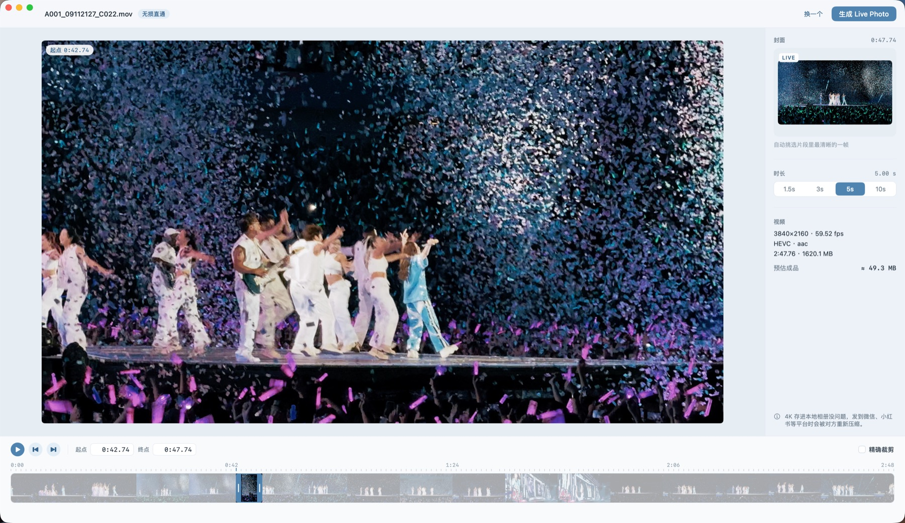

<p align="center">
  
</p>

<h1 align="center">VideoToLive</h1>

<p align="center">
  把视频转成 Apple Live Photo 的 macOS 应用。<b>视频轨不重新编码，输出码流与源片段逐字节一致。</b>
</p>

<p align="center">
  <a href="https://github.com/xLuckww/VideoToLive/releases/latest">下载最新版本</a> ·
  macOS 13+ · Apple Silicon 与 Intel
</p>



转好的实况照片会直接写入「照片」App，并通过 iCloud 同步到 iPhone。无时长限制、无次数限制、无水印，全程离线处理。

## 为什么做这个

大多数视频转实况工具都会重新编码视频，4K 素材转完画质会明显下降。VideoToLive 只重新封装容器，把原始 H.264 / HEVC 码流原样搬进 Live Photo 所需的 MOV 文件。

这不是一句宣传语，可以用 ffmpeg 自己验证：

```bash
ffmpeg -v error -ss 10 -t 5 -i 源视频.mov -map 0:v:0 -c copy -f md5 -
ffmpeg -v error -i 输出.mov -map 0:v:0 -c copy -f md5 -
```

两行输出的 MD5 相同。

## 功能

- **拖入即用**：支持 MP4、MOV、M4V，打开后显示分辨率、帧率、编码，并标出「无损直通」或「需重编码」
- **选片段**：拖动时间轴选区、拖两端调整长度，或直接输入起点、终点时间
- **时长预设**：1.5 秒、3 秒、5 秒、10 秒
- **关键帧辅助**：刻度尺标出所有关键帧，可以一键跳到上一个或下一个关键帧
- **预览**：画面跟随起点或终点，可以只播放选中的片段
- **自动选封面**：在片段里挑出最清晰的一帧作为静态封面
- **精确裁剪**：需要从任意帧切开时可以开启，代价是视频轨会重新编码
- **写入照片图库**：分阶段显示进度，完成后可以一键在「照片」中查看；失败时会说明是哪一步出了问题

## 使用前需要知道的三点

1. **封面图不是比特级无损。** Live Photo 的封面必须是 HEIC 或 JPEG，从视频抽帧必然要重新编码。默认使用最高质量 HEIC，视觉上无损。
2. **片段起点会吸附到关键帧。** 不重新编码时只能从关键帧切开，所以松开选区后起点会对齐到前一个关键帧，时长保持不变。确实需要精确到某一帧，就开启「精确裁剪」。
3. **4K 实况分享出去会被压缩。** 存在本地相册里没问题，但发到微信、小红书等平台时，对方服务器会重新压缩。

## 下载安装

1. 在 [Releases](https://github.com/xLuckww/VideoToLive/releases/latest) 下载 `VideoToLive-版本号.dmg`
2. 打开 DMG，把 VideoToLive 拖到「应用程序」
3. 第一次打开时，macOS 会提示「无法验证开发者」。这是因为 App 没有经过 Apple 公证，处理方法：
   - 打开「系统设置 → 隐私与安全性」，在页面下方找到 VideoToLive，点击「仍要打开」
   - 或者在终端运行：

     ```bash
     xattr -dr com.apple.quarantine /Applications/VideoToLive.app
     ```

4. 首次写入照片图库时，系统会请求权限，允许即可

## 从源码构建

需要 macOS 13 或更高版本，以及 Swift 6 工具链。只需要 Command Line Tools，不需要完整 Xcode。

```bash
xcode-select --install
git clone https://github.com/xLuckww/VideoToLive.git
cd VideoToLive
./Scripts/build-app.sh
open build/VideoToLive.app
```

其他脚本：

| 命令 | 用途 |
|---|---|
| `./Scripts/build-app.sh --universal` | 编译同时支持 Apple Silicon 与 Intel 的版本 |
| `./Scripts/make-dmg.sh` | 打包发布用的 DMG，输出到 `dist/` |
| `swift Scripts/make-icon.swift` | 重新生成 App 图标 |

## 使用步骤

1. 把视频拖进窗口，或者点击「选择视频」
2. 在底部时间轴上选择片段，或者在右侧栏选择时长
3. 点击播放按钮，确认片段内容
4. 点击右上角「生成 Live Photo」
5. 生成完成后，点击「在照片中显示」

## 命令行工具

项目还包含一个命令行工具 `vtl`，适合批量处理和验证结果。

```bash
swift build -c release
.build/release/vtl convert 视频.mov --start 0:11 --duration 5
```

| 命令 | 用途 |
|---|---|
| `inspect <视频>` | 查看视频信息和转换模式 |
| `keyframes <视频>` | 列出关键帧位置 |
| `convert <视频> [选项]` | 转换并写入照片图库 |
| `verify <mov> [封面]` | 检查输出文件里的 Live Photo 元数据 |
| `frames <视频> --at <秒>` | 连续抽帧，验证帧定位是否精确 |
| `stress <视频>` | 连续转换多次，观察内存占用 |
| `timecode` | 运行时间码解析自测 |

`convert` 常用选项：

| 选项 | 说明 |
|---|---|
| `--start` | 起点，支持 `12.5` 或 `1:02.5` 写法 |
| `--duration` | 时长，默认 3 秒 |
| `--cover` | 封面时间点，或使用 `auto` 自动挑选 |
| `--format` | 封面格式，`heic` 或 `jpeg` |
| `--precise` | 精确裁剪，会重新编码视频轨 |
| `--no-audio` | 不保留音轨 |
| `--no-import` | 只生成文件，不写入照片图库 |
| `--out` | 输出目录 |

## 工作原理

Live Photo 由一张静态图和一段 MOV 视频组成，系统通过同一个 UUID 把两者识别为一组：

1. 静态图的 Apple Maker Note 键 `17` 中写入 UUID
2. MOV 的 `com.apple.quicktime.content.identifier` 元数据写入同一个 UUID
3. MOV 额外包含一条 `com.apple.quicktime.still-image-time` 定时元数据轨，标记封面在视频中的位置

视频部分使用 `AVAssetReader` 和 `AVAssetWriter`，两端的 `outputSettings` 都设为 `nil`，因此只搬运样本，不解码也不重新编码。这里没有使用 `AVAssetExportSession`，因为它无法写入自定义的定时元数据轨。

最后通过 `PHAssetCreationRequest` 把图片和视频作为同一个资产写入图库，并检查结果是否包含 `.photoLive`。

## 项目结构

```
Sources/
├── VideoToLiveCore/           核心库，不依赖界面
│   ├── VideoInspector         解析视频，判断能否无损直通
│   ├── KeyframeIndex          查找关键帧，计算片段吸附位置
│   ├── CoverFrameExtractor    精确抽帧，写入带 Maker Note 的封面
│   ├── SharpnessScorer        用拉普拉斯方差评估清晰度
│   ├── LivePhotoVideoWriter   无损封装视频并写入 Live Photo 元数据
│   ├── PhotoLibraryImporter   写入照片图库
│   ├── LivePhotoConverter     串联整个转换流程
│   └── Timecode 等            基础类型和工具
├── VideoToLive/               SwiftUI 界面
│   ├── AppModel               界面状态和交互逻辑
│   ├── ContentView            窗口布局、顶栏、空状态
│   ├── PreviewMonitor         预览画布、进度和结果浮层
│   ├── InspectorSidebar       右侧栏
│   ├── TimelineDock           底部时间轴
│   └── Theme                  颜色和控件样式
└── vtl/                       命令行工具
```

更完整的技术方案见 [开发方案](LivePhotoForge-开发方案.md)，验证数据见 [阶段一验证报告](docs/阶段一验证报告.md)。这两份是开发早期的记录，当时项目还叫 LivePhotoForge，命令行工具叫 `lpforge`。

当前进度、技术约定与环境限制见 [项目状态](docs/项目状态.md)。

## 开发状态

已完成：

- [x] 无损封装和 Live Photo 元数据写入
- [x] 写入照片图库并检查识别结果
- [x] 时间轴选片段、关键帧吸附、精确裁剪
- [x] 视频预览和自动选封面
- [x] 同时支持 Apple Silicon 与 Intel 的 DMG 安装包

计划中：

- [ ] 手动逐帧选择封面
- [ ] 批量队列
- [ ] 偏好设置，例如封面格式、是否保留音轨、默认时长

## 许可证

[MIT](LICENSE)
